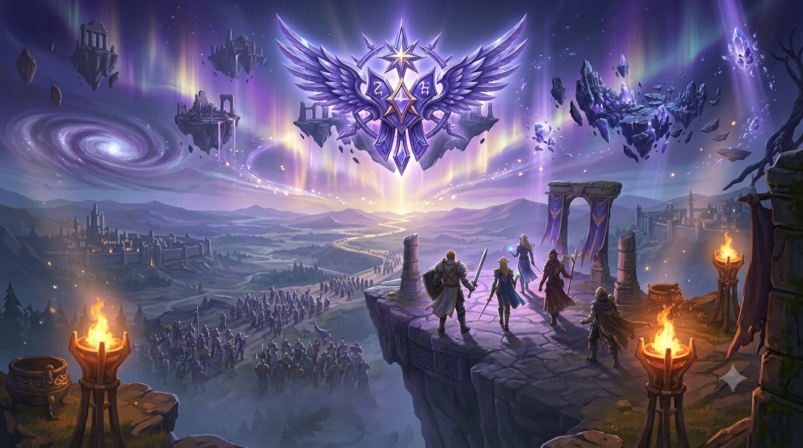

<p align="center">
  
</p>

# Kisk — Bot de groupes pour Aion 2

🇬🇧 [English version](README.md)

**Kisk** est un bot Discord pour organiser les groupes à la sortie d'Aion 2 :
donjons, sorties PvP, farm en abysses. Une commande crée un « call », et
chacun s'inscrit en un clic en choisissant son rôle (🛡️ Tank, 💚 Heal,
🗡️ DPS). Comme le kisk en jeu, c'est la balise qu'on pose avant le combat.

> ℹ️ Le bot parle **anglais** (commandes et messages) pour une utilisation
> internationale — ce guide, lui, est en français. Les horaires peuvent se
> taper dans les deux langues : `demain 21h` et `tomorrow 9pm` marchent
> tous les deux.

## Fonctionnalités

- **`/event`** : crée un appel de groupe avec titre, type (🏰 Dungeon,
  🐉 Raid, 🚩 Battleground, ⚔️ PvP, 🌀 Rift, 🌌 Abyss, 🎲 Other), horaire et
  description.
- **Trois modes de composition** : groupe de 5 (1 tank / 1 heal / 3 DPS),
  groupe de 10 (2/2/6, pour raids et battlegrounds), ou libre (« Open »,
  2 à 25 places, rôles sans limite — parfait pour le farm en abysses).
- **Inscription par boutons**, changement de rôle, bouton Leave, et
  liste d'attente avec **promotion automatique** quand une place se libère.
- **Horaires intelligents** : `21:00`, `9pm`, `demain 21h`, `30/08 21:00` —
  affichés ensuite dans le fuseau horaire de chaque joueur.
- **Rappels automatiques** avant le début (15 min par défaut).
- **`/events`** : les sorties à venir avec liens cliquables.
- **Profils** : `/profile set` enregistre ton main et ton alt (nom, classe,
  rôle) ; la classe s'affiche à côté du pseudo dans les groupes.
  `/profile show` et `/roster` pour consulter.
- **Absences** : `/away start: 30/08 until: 05/09`, liste avec `/absences`,
  retour anticipé avec `/back`.
- **Annonces** : `/announce` (modérateurs), formulaire multi-lignes, ping
  d'un rôle en option.
- **Sondages** : `/vote` (2 à 5 choix), résultats en direct, clôture par
  l'auteur ou un modérateur.
- **Dispos de la semaine** : `/availability post` publie le tableau
  Lundi→Dimanche à cocher ; `/availability weekly` le republie chaque
  semaine automatiquement.
- **Bouton « Done ✅ »** : clôt la sortie avec un GG aux participants.
- **Panneau sans commande** : `/panel` (modérateurs) publie un message à
  épingler dont les boutons ouvrent un formulaire à remplir — créer une
  sortie ou signaler une absence sans taper la moindre commande.
- **Salons dédiés** : `/channels` (modérateurs) choisit où sont publiées les
  sorties et les absences, pour que le panneau épinglé reste visible.
- **Accueil des nouveaux** : `/welcome` (modérateurs).
- **Statut du bot** : la prochaine sortie s'affiche dans son statut Discord.
- **Persistance SQLite** : les boutons survivent aux redémarrages.

## Installation pas à pas

### 1. Créer le bot sur le portail Discord

1. Va sur <https://discord.com/developers/applications> → **New Application**,
   nomme-la « Kisk ». Mets l'avatar (`assets/avatar.png`) et la bannière
   (`assets/banner.png`) dans **General Information** et dans l'onglet **Bot**.
2. Onglet **Bot** → **Reset Token** → copie le token quelque part de sûr.
   ⚠️ **Ne partage jamais ce token**. S'il fuite, refais « Reset Token ».
3. Toujours dans l'onglet **Bot**, active **SERVER MEMBERS INTENT**
   (nécessaire pour accueillir les nouveaux membres).
4. Onglet **Installation** (ou OAuth2 → URL Generator) : coche les *scopes*
   `bot` et `applications.commands`, et les permissions **Send Messages**,
   **Embed Links** et **Read Message History**. Ouvre l'URL générée et
   invite le bot sur ton serveur.

### 2. Lancer le bot sur ton PC (pour tester)

Il faut Python 3.11 ou plus récent (<https://www.python.org/downloads/>).

```bash
git clone https://github.com/NaxosOne/aion2-group-bot.git
cd aion2-group-bot

python -m venv .venv
source .venv/bin/activate        # Windows : .venv\Scripts\activate

pip install -r requirements.txt

cp .env.example .env             # Windows : copy .env.example .env
# Édite .env : colle ton DISCORD_TOKEN, et mets ton GUILD_ID pour que les
# commandes apparaissent immédiatement sur ton serveur.

python -m bot.main
```

Quand tu vois `Logged in as ...`, tape `/event` sur ton serveur. 🎉

### 3. L'héberger 24h/24

Voir **[DEPLOYMENT.fr.md](DEPLOYMENT.fr.md)** (guide en français) : les
options gratuites ou quasi gratuites, avec les étapes détaillées.

## Utilisation

```
/event title: Donjon du Feu HM  type: Dungeon       comp: Party of 5   when: demain 21h
/event title: BG du soir        type: Battleground  comp: Party of 10  when: 21:00
/event title: Farm abysses      type: Abyss         comp: Open         size: 8
/events                   → les sorties à venir

/profile set character: Main  name: Kratos  class: Templar  role: Tank
/profile show [member]    → le profil d'un membre
/roster                   → tous les persos de la légion

/away start: 30/08 until: 05/09 reason: vacances
/absences                 → qui est absent ou bientôt absent
/back                     → retour anticipé

/announce [ping: @rôle]   → annonce mise en forme (modérateurs)

/vote question: On fait quoi ? option1: Donjon option2: PvP option3: Rien
/availability post        → tableau des dispos de la semaine
/availability weekly      → le republier chaque semaine ici (modérateurs)
/welcome                  → accueillir les nouveaux dans ce salon (modérateurs)
/panel                    → publier le panneau tout-en-boutons (modérateurs)
/channels events: #sorties absences: #absences   → où atterrissent les résultats
```

**Astuce** : publie `/panel` dans un salon dédié et épingle-le, puis lance
`/channels events: #sorties absences: #absences` pour que le panneau ne soit
jamais noyé sous ses propres résultats. Ceux qui galèrent avec les commandes
cliquent simplement sur **Create an event** ou **Report an absence**,
remplissent la fenêtre, et reçoivent un lien vers la sortie créée dans le
salon dédié.

Les emojis des rôles et des types de sortie sont remplaçables par le pack
d'icônes fourni dans [`assets/emoji/`](assets/emoji/README.md) : uploade les
PNG dans le portail développeur (onglet **Emojis**), puis renseigne
`EMOJI_TANK`, `EMOJI_DUNGEON`... dans le `.env`. Ils s'affichent dans les annonces, les boutons et les
messages ; en revanche les listes de choix des commandes slash sont du texte
brut où seuls les emojis Unicode fonctionnent.

Les classes proposées par `/profile` sont des suggestions (champ libre) : la
liste se modifie dans `bot/cogs/profiles.py` (`AION_CLASSES`) quand les noms
définitifs des classes d'Aion 2 seront connus.

## Structure du projet

Voir le [README anglais](README.md#project-layout) — en résumé : `bot/`
contient le code (un fichier par sujet, cogs pour les commandes), `tests/`
les tests de la logique de répartition et du parseur d'horaires.
